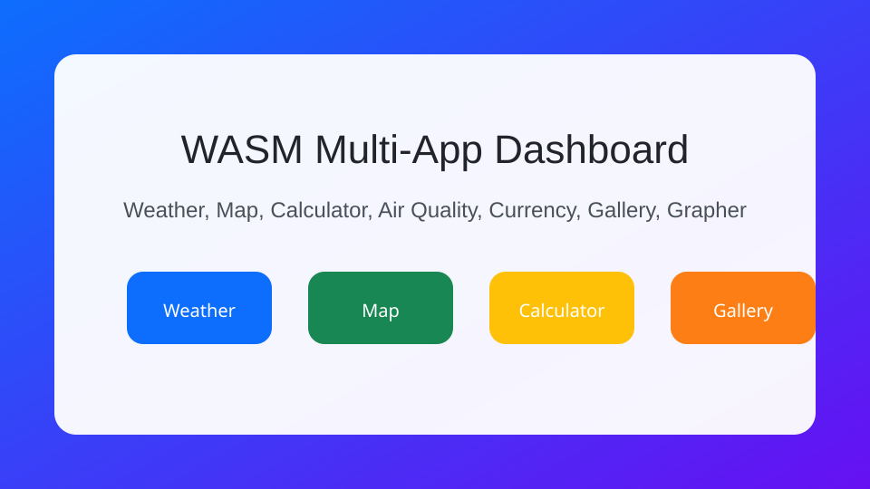
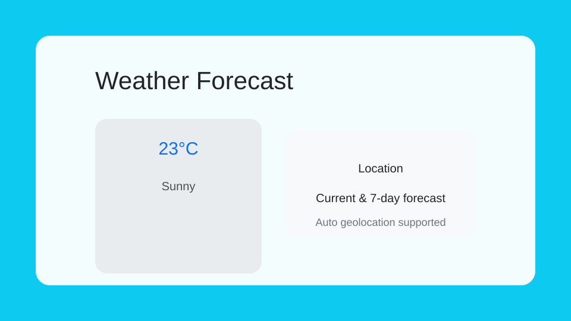
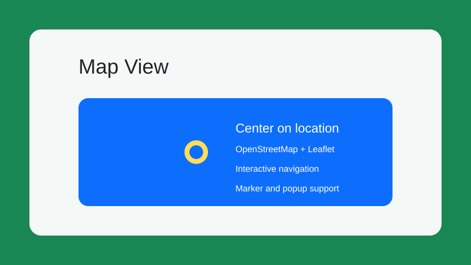
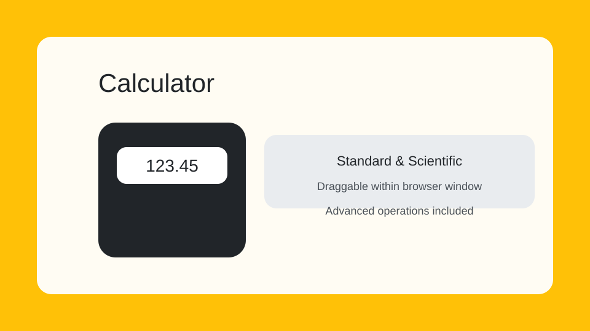

# WASM Multi-App

Live demo: https://mrunal77.github.io/WASM/

## Overview

This repository contains a Blazor WebAssembly app with multiple built-in utilities and experience-focused features:

- **Weather Forecast** — live weather data via Open-Meteo and browser geolocation.
- **Stopwatch** — centisecond stopwatch with start, pause, lap, and reset controls.
- **Color Code** — color picker with HEX, RGB, HSL, and HSV conversion, copy buttons, recent colors, and contrast guidance.
- **Map** — interactive Leaflet map with OpenStreetMap tiles and current location support.
- **Calculator** — draggable standard and scientific calculator inside the browser.
- **Air Quality** — latest PM2.5, PM10, and CO readings from Open-Meteo air-quality data.
- **Currency Converter** — simple exchange rate conversion using exchangerate.host.
- **Image Gallery** — browser webcam capture and photo preview.
- **Function Grapher** — simple function plotter built in SVG.
- **Code Snapshot** — code-to-image generator: syntax-highlighted code cards with 23 languages and 9 themes, downloadable as PNG or copyable as an image/code.
- **File Compressor** — client-side image and PDF compression with a quality slider, resize, format conversion, and PDF metadata stripping. Files never leave the browser.

## Screenshots

### Home Dashboard



### Weather Forecast



### Map View



### Calculator



## Project Structure

- `Pages/` — Blazor pages for the app tabs.
- `wwwroot/` — static assets, JavaScript helpers, and the Blazor entry page.
- `.github/workflows/` — CI/CD workflows for GitHub Pages and Vercel deployments.
- `vercel.json` — Vercel routing config for SPA support.

## Requirements

- .NET SDK 10.0
- Blazor WebAssembly workload (`dotnet workload install wasm-tools`)

## Running Locally

1. Restore and build:
   ```bash
   dotnet build WASM.csproj -c Release
   ```
2. Run the app:
   ```bash
   dotnet run --project WASM.csproj
   ```
3. Open the browser at the URL shown in the console.

## Deployment

### GitHub Pages

The repository includes a GitHub Actions workflow at `.github/workflows/dotnet.yaml` that publishes the app to the `gh-pages` branch. The workflow:

- builds the Blazor WASM app
- overwrites the `base` tag in `index.html` for `WASM/`
- copies `index.html` to `404.html`
- creates `.nojekyll`
- deploys using `JamesIves/github-pages-deploy-action@3.7.1` with `clean: true`

### Vercel

The Vercel workflow is in `.github/workflows/vercel-deploy.yml`. It builds the app, publishes to `release/wwwroot`, and deploys that static output to Vercel.

The `vercel.json` file configures SPA rewrites so Blazor routes work correctly.

> Note: Vercel deployment requires a repository secret named `VERCEL_TOKEN`.

## Notes

- If browser geolocation is denied, some features may show an error message and require permission to be enabled.
- The app uses third-party APIs with no API key required for the current implementation.

## Contact

For updates or fixes, commit to the `main` branch and deploy via GitHub Actions or Vercel.
